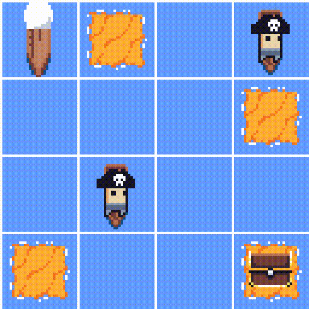
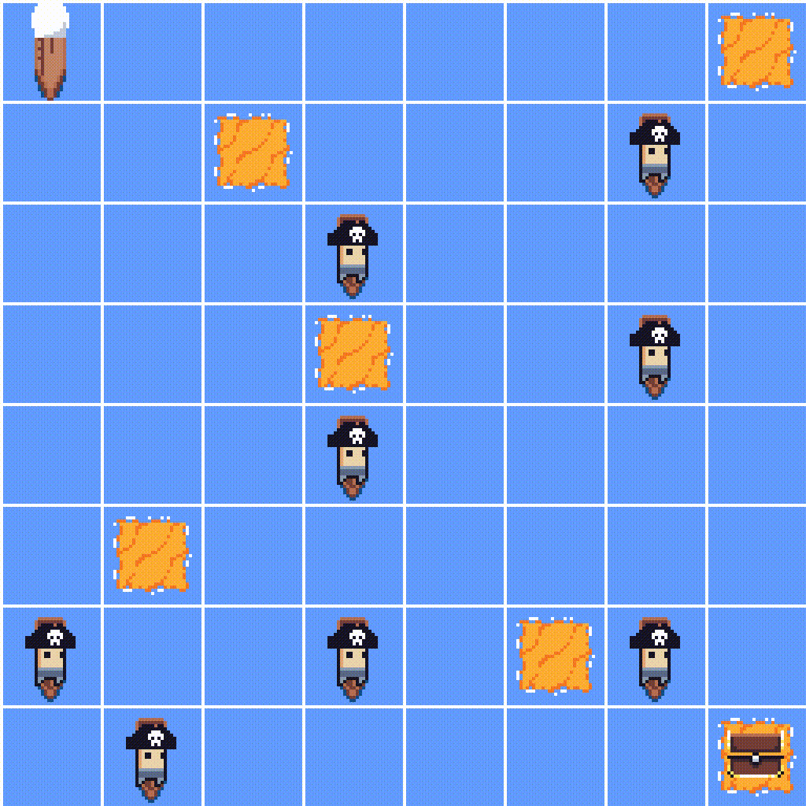

# Pirate Islands Environment

**`PirateIslandsEnv`** is a discrete grid environment inspired by pirate adventures.  
The goal of the agent is to navigate the sea, visit all clue islands (`I`) at least once, and then reach the treasure (`T`), while avoiding enemy ships (`E`).

The environment can optionally include wind, which adds stochasticity to the agent's movement.

## Key Information

| Feature            | Description                                                                                    |
|--------------------|------------------------------------------------------------------------------------------------|
| Action Space       | Discrete(4)                                                                                    |
| Observation Space  | Discrete(grid_size * grid_size * (num_islands + 1)) for count-based encoding,                  |
|                    | Discrete(grid_size * grid_size * (1 << num_islands)) for bitmask-based encoding.               |
| Import             | `gymnasium.make("PirateIslands-v1")`                                                           |

## Environment Description

- **Grid:** Square grid of size `4x4`, `8x8`, or procedurally generated (`random_NxN`).  
- **Grid elements:**
  - `S` – starting position of the agent
  - `W` – water (navigable)
  - `I` – clue island
  - `T` – treasure
  - `E` – enemy pirate

- **Objective:** Visit all clue islands exactly once and then reach the treasure.  
- **Episode Termination:** Occurs when:
  - The agent reaches the treasure after visiting all islands
  - The agent collides with an enemy ship
  - The agent revisits the same island

## Procedural Map Generation

The environment supports both **fixed** and **randomly generated** maps.

- **Fixed maps:** `"4x4"` and `"8x8"` are predefined static layouts.  
- **Random maps:** Use `map_name="random_NxN"` (e.g., `"random_12x12"`, `"random_16x16"`).  

During random map generation:
- The grid starts filled with water (`W`).
- One start position (`S`) and one treasure (`T`) are placed at opposite corners.
- A set of islands (`I`) and enemies (`E`) are placed procedurally according to density parameters (`island_density`, `enemy_density`).
- Placement uses a **safe rule** that prevents blocking paths: `S`, `I`, and `T` always remain reachable (no full enclosure by enemies).

To generate a new random map at every episode:
```python
env = PirateIslandsEnv(map_name="random_12x12", randomize_each_reset=True)
```

If `randomize_each_reset=False`, the same random map will be reused across episodes (useful for debugging).

## Observation Space

The observation encodes the agent's position and which clue islands have been visited. Two state encoding modes are supported:

### Count-based (state_encoding="count")  
- Type: Discrete(grid_size * grid_size * (num_islands + 1))  
- Encodes: agent position + number of visited islands  
- Formula:  
  pos_index = y * grid_size + x
  visited_count = number of islands visited (0 to num_islands)
  state = pos_index * (num_islands + 1) + visited_count

### Bitmask-based (state_encoding="bitmask")  
- Type: Discrete(grid_size * grid_size * (1 << num_islands))  
- Encodes: agent position + exact set of visited islands  
- Formula:  
  pos_index = y * grid_size + x
  visited_mask = binary mask of visited islands (1 = visited, 0 = not visited)
  state = pos_index * (1 << num_islands) + visited_mask

Note:
The bitmask encoding allows the agent to distinguish exactly which islands were visited, while the count-based encoding only tracks the total number of islands visited.

> In random maps, the number of islands (`num_islands`) is determined dynamically at map creation, so the observation space adapts automatically.

## Action Space

- Type: `Discrete(4)`  
- Actions:
  - `0` – move up
  - `1` – move down
  - `2` – move left
  - `3` – move right

> If wind is active (`is_blowing_in_the_wind=True`):  
> - With probability `wind_prob`, the chosen action can be deviated.  
> - The deviation is limited to adjacent actions (`left` or `right` relative to the original action).  
> - The resulting position is validated: it cannot move the agent into an enemy or an already visited clue island.  
> - If no valid deviation exists, the original action is applied.

## Rewards

- `-0.1` – normal movement
- `+1` – visit a clue island for the first time
- `-1` – revisit the same island
- `-10` – collide with an enemy ship
- `+10` – reach the treasure after visiting all clue islands

## Rendering Modes

- `text` – simple text-based grid:
  - `A` – agent
  - `I` – unvisited clue island
  - `i` – visited clue island
  - `T` – treasure
  - `E` – enemy ship
  - `W` – water

- `text_emoji` – emoji-based grid (optional):
  - `⛵` – agent
  - `🏝️` – unvisited clue island
  - `🚩` – visited clue island
  - `💰` – treasure
  - `☠️` – enemy pirate
  - `🌊` – water

- `human_tilemap` – graphical tilemap display using Pygame:
  - Shows the agent, islands, treasure, and enemies with tile graphics in a Pygame window.
  - The window automatically scales depending on grid size (tile size and zoom adjust to prevent oversized windows).

- `rgb_array_tilemap` – offscreen tilemap rendering:
  - Returns an RGB array of the current game state using tile graphics.
  - Useful for recording videos or using the environment with machine learning agents.

## Example Usage

### 4x4 or 8x8 fixed maps
```python
env = PirateIslandsEnv(map_name="4x4", render_mode="text")

env = gym.make(
    "PirateIslands-v0",
    map_name="4x4",
    render_mode="text"
)

obs, _ = env.reset()
env.render()

obs, reward, terminated, truncated, _ = env.step(1)
env.render()
```

### Procedural generation
```python
env = gym.make(
    "PirateIslands-v0",
    map_name="random_12x12",
    render_mode="human_tilemap",
    randomize_each_reset=True,
)

obs, _info_ = env.reset()
env.render()

obs, reward, terminated, truncated, _ = env.step(1)
env.render()
```


## Demonstration

Here are examples of the PirateIslandsEnv in action:

### **4x4 Map:**


### **8x8 Map:**



## Credits

Tileset used: [RPG Beach Tileset](https://stealthix.itch.io/rpg-beach-tileset) by Stealthix.

Available for free under CC0 1.0.